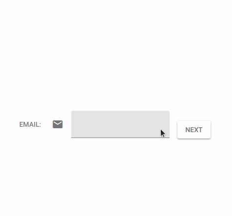

The Quasar QInputEx Component which compatible with Quasar UI v2 and Vue 3.

# Quasar QInputEx Component

The Advance Input Component for Quasar is used as single-line input box for date, time, password, color, select etc.



## Usage

This component is compatible with Quasar UI v2 and Vue 3.

### Installation

Install the UI kit and app extension:

```bash
pnpm add quasar-ui-qinputex
pnpm add -D quasar-app-extension-qinputex
```

### Quasar Configuration

Ensure your `quasar.conf.js` (or `quasar.config.js` for Quasar v2) has the necessary Quasar components and directives enabled. The `quasar-app-extension-qinputex` should automatically configure these for you, but for manual setup or debugging, here's what's needed:

**Components:**
`QBtn, QIcon, QPopupProxy, QCard, QCardSection, QToolbar, QToolbarTitle, QInput, QSelect, QDate, QTime, QColor, QChip`

**Directives:**
`ClosePopup`

**Plugins:**
`vue-i18n`

### Component Slots

`QInputEx` supports the following slots:

**Internal Slots (same as `QInput`):**
* `before`
* `prepend`
* `append`
* `after`

**External Slots (new in `QInputEx`):**
* `top`: the slot on the top of QInput Component
* `bottom`: the slot on the bottom of QInput Component

### Properties

* `type` *string|InputType*
  * `string`: the exists(registered) input type name.
  * `InputType`: customize input type or override exists InputType.
    * `name` *string* : it will override the exists InputType if the name is exists

### Supported Input Types

`QInputEx` comes with several pre-registered input types:

* `text`, `textarea`, `number`
* `color`
* `date`
* `datetime`
* `fulltime`
* `time`
* `password`: show password or not.
* `search` (TODO: This type needs to be re-implemented for Quasar v2)

### Demo Usage

```vue
<template>
  <q-page class="q-pa-md">
    <div class="q-gutter-md">
      <q-input-ex v-model="text1" label="Default Text Input" />
      <q-input-ex v-model="dateValue" label="Date Input" type="date" />
      <q-input-ex v-model="passwordValue" label="Password Input" type="password" />
    </div>
  </q-page>
</template>

<script setup>
import { ref } from 'vue';

const text1 = ref('Hello QInputEx');
const dateValue = ref('2023/07/05');
const passwordValue = ref('mysecretpassword');
</script>
```

## Create a new input type

You can easily register new input types or override existing ones. Here's an example of how `DateInput` and `PasswordInput` are defined internally:

```javascript
// Example from ui/src/components/QInputEx/utils.js

import { markRaw } from 'vue';
import { register } from './utils'; // Assuming this is your register function

function padStr(value, size = 2) {
  var s = String(value);
  while (s.length < size) {s = "0" + s;}
  return s;
}

function getCurrentYM() {
  const vDate = new Date();
  const result = vDate.getFullYear() + '/' + padStr(vDate.getMonth()+1, 2);
  return result;
}

export const DateInput = {
  name: 'date',
  type: 'text',
  mask: 'date',
  rules: ['date'],
  attaches: {
    'append': {
      icon: 'event',
      popup: markRaw({
        ref: 'date',
        name: 'QDate',
        attrs: {
          'default-year-month': getCurrentYM()
        },
        on: {
          input(value, reason, detail, { iValue, nativeType, attaches, popupRef }) {
            if (['day', 'today'].indexOf(reason) !== -1) popupRef.hide();
            return value;
          }
        }
      })
    }
  }
}

export const PasswordInput = {
  name: 'password',
  type: 'password',
  attaches: {
    'before': {
      icon: 'vpn_key',
    },
    'append': {
      icon: 'visibility',
      click: function(e, { nativeType, attaches }) {
        const isVisiblePwd = nativeType.value === 'text';
        nativeType.value = isVisiblePwd ? 'password' : 'text';
        attaches.value.append.icon = isVisiblePwd ? 'visibility' : 'visibility_off';
      }
    }
  }
}

register(DateInput);
register(PasswordInput);
```

## Migration Log: Quasar v1 to v2 Refactoring of QInputEx

This section details the challenges encountered and solutions implemented during the migration of the `QInputEx` component from Quasar v1 (Vue 2, Class Components, TSX) to Quasar v2 (Vue 3, Composition API, SFC).

### Key Migration Points & Challenges:

1.  **Vue 2 Class Component to Vue 3 Composition API (`<script setup>`)**: The original `QInputEx` was a Vue 2 class component using `vue-property-decorator` and TSX for rendering. This required a complete rewrite to Vue 3's Composition API with `<script setup>` syntax and standard `<template>` HTML.
    *   **Solution**: Rewrote component logic, props, and event handling to the new API. Replaced TSX rendering with standard Vue 3 template syntax.

2.  **`this` Context in Composition API**: A major challenge was the absence of `this` in Vue 3's `setup` function. Original `attaches` `click` handlers and `popup` `on.input` handlers heavily relied on `this` to access component state (`nativeType`, `attaches`, `iValue`).
    *   **Problem**: `ReferenceError: this is not defined` or `Cannot read properties of undefined` errors.
    *   **Solution**: Modified `getAttach` and `getPopupVNode` to explicitly pass relevant reactive variables (`iValue`, `nativeType`, `attaches`, `popupRef`) as arguments to the `click` and `on.input` handlers. This allowed the handlers to directly manipulate the component's state without relying on `this`.

3.  **Quasar Component and Directive Registration**: `QInputEx` depends on several Quasar components (`QBtn`, `QPopupProxy`, `QDate`, etc.) and the `v-close-popup` directive. These need to be explicitly enabled in Quasar v2 projects.
    *   **Problem**: `Failed to resolve component` errors for Quasar components, and `v-close-popup` not working.
    *   **Solution**: Updated `ui/dev/quasar.config.js` and `app-extension/src/index.js` to include these components and directives in the `framework.components` and `framework.directives` options.

4.  **`vue-i18n` Integration**: The original component used `$t` for internationalization. Integrating `vue-i18n` with Vue 3 and Quasar v2 required specific setup.
    *   **Problem 1**: `Cannot read properties of undefined (reading '$t')`.
        *   **Solution**: Imported `useI18n` from `vue-i18n` in `QInputEx.vue` and replaced `this.$t` with `t()`.
    *   **Problem 2**: `The message format compilation is not supported in this build.`
        *   **Solution**: Ensured `vue-i18n@9.x` was installed (not older alpha versions). Configured `createI18n` with `legacy: false` in `boot/i18n.js` files for both `ui/dev` and `app-extension`.
    *   **Problem 3**: Incorrect language displayed (e.g., always English).
        *   **Solution**: Set `locale: 'zh-hans'` and `fallbackLocale: 'en-us'` in `createI18n` configuration.

5.  **Dynamic Component Rendering (`QDate` in Popup)**: The `DateInput` type dynamically renders `QDate` within a `QPopupProxy`.
    *   **Problem**: `QDate` component not displaying in the popup.
    *   **Solution**: Corrected the `h` function usage to pass `modelValue` instead of `value` to the dynamically rendered component. Used `resolveComponent` to correctly resolve the component name string to a Vue component instance.

6.  **`QPopupProxy` Close Button**: The close button in the popup was not closing the `QPopupProxy`.
    *   **Problem**: `v-close-popup` directive not working as expected with dynamic `h` rendering.
    *   **Solution**: Implemented manual closing by adding a `ref` to `QPopupProxy` and calling `popupRef.value.hide()` on the close button's `onClick` event.

7.  **Vue Reactive Object Warning (`markRaw`)**: A persistent warning about making components reactive objects.
    *   **Problem**: `[Vue warn]: Vue received a Component that was made a reactive object.`
    *   **Solution**: Used `markRaw` to wrap `TestPopupComponent` in `TestQInputEx.vue` where it's defined in `popupType`. Crucially, also applied `markRaw` to `popup.name` within the `cloneType` function in `QInputEx.vue` to prevent Vue's deep reactivity from making the component definition reactive during internal state copying.

### Remaining Tasks (Future Work):

*   **`search` Input Type**: The `search` input type from v1, which includes `q-input-history` and related logic, needs to be re-implemented for Quasar v2.


# Structure
* [/ui](ui) - standalone npm package

* [/app-extension](app-extension) - Quasar app extension


# Donate
If you appreciate the work that went into this project, please consider [donating to Quasar](https://donate.quasar.dev).

# License
MIT (c) Riceball LEE <snowyu.lee@gmail.com>